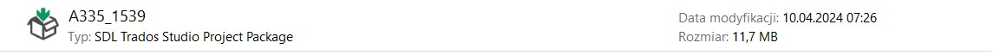
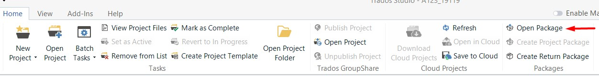
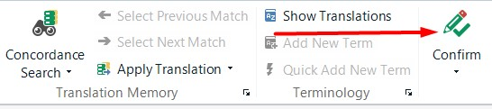
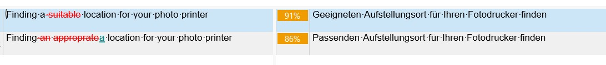
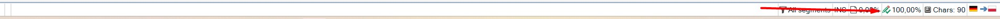

---

title: First steps with Trados - how to start
layout: default
nav_order: 3

---
FIRST STEPS WITH TRADOS - HOW TO START
===============

Since you are will work with Trados, you must know how to use its basic functions.

**TRADOS PACKAGE - HOW TO OPEN IT**

Each project consists of several XML files that you can find in a Trados package. In order to start working with it, please follow these steps:

Locate the Trados Package File: in most cases, it has a ".sdlppx" extension. The name of the Trados package is the name of the project assigned to you.

Launch SDL Trados Studio (the icon is on your desktop).

Open the Trados Package: In SDL Trados Studio, go to the "Home" menu and select "Open Package." You can also use the keyboard shortcut Ctrl + O. This will open a file dialog box.

Select the Trados Package File: Navigate to the location where the Trados package file is saved, select it, and click "Open."

Review Contents: Once the package is imported, you'll see its contents in the SDL Trados Studio interface.

**TRANSLATION PHASE**

Now have a look at your **translation pane**. It is the place where you need to write your translation. Every file consists of several segments. You can see some numbers near them. 
These are the so-called matches. Here is a short overview:

| Name            | Description                                                                                                                                                      |
|-----------------|------------------------------------------------------------------------------------------------------------------------------------------------------------------|
| 100% Match      | These segments are an exact equivalent a segment stored in the translation memory. This means that the entire segment has been translated previously.             |
| Context Match (CM)   | Context matches are very similar to previously translated segments, which was found on the basis of the surrounding text and context.                          |
| Repetitions (light green)     | You can see repetitions when the same segment appears many times in a a document. |
| Fuzzy Match (1-99%)     | Fuzzy matches are similar to 100% matches but have smaller or bigger differences, such as variations in punctuation, terminology, or word order.                             |
| No Match        | When Trados cannot find any similar segments in the translation memory, it categorizes the segment as a "no match". It simply means you must translate the sentence on your own.  
|

**SHOULD I STAY OR SHOULD I GO? HOW TO HANDLE THE TRADOS SEGMENTS**

Before you start working on your project, have a look at the chapter [Project_briefing_analysis](Project_briefing_analysis.md). Verify the given project requirements and check what the client ordered. If it is **translation-only**, please start with the first segment you see
and continue with all of them, checking all the segments (content + grammar). Try to maintain consistency within the file itself as well as in the entire project. Don't forget to confirm every single segment with the "Confirm" button. Otherwise you can lose all your work results!

**FUZZY MATCHES - TRICKS AND BEST PRACTICES**

While it is fairly easy to handle the 100% matches and repetitions, things go a bit complicated when you see a fuzzy match. In such a case, Trados suggests a translation along with a percentage that shows the level of similarity to the stored version. Begin by reviewing the suggested translation and the source segment to understand the context.

Study the following example:

Compare Source and Target: Compare the source segment with the suggested translation to identify any differences. Pay attention to variations in punctuation, terminology, word order, and context.

Depending on the similarity and the context, you may need to edit the suggested translation. Sometimes the changes may be just minor, so please be careful.

**FINAL...COUNTDOWN...NO, FINAL STEPS**

Now that you have the 100% score in the bottom page bar, you need to proceed differently, depending on your workflow. For more information, please see the following chapters.

