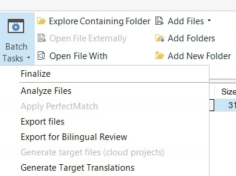
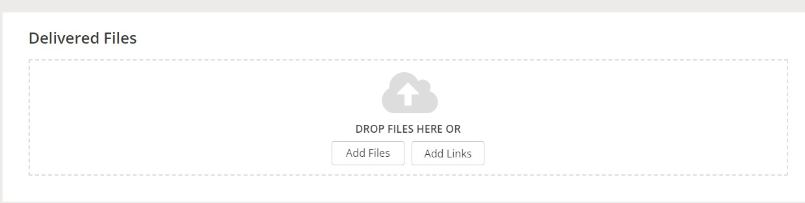

---

title: Post-processing of the translated files
layout: default
nav_order: 6

---
POST-PROCESSING OF THE TRANSLATED FILES
===============
The general workflow was already covered in the previous parts. This chapter is meant to give you a short overview of the process, with a
special reference to [various workflows ordered by the client](Project_briefing_analysis.html). 

>ℹ In general, please remember to report any doubts early enough so that they can be addressed by our team and to avoid any delays of the entire process.

**TRANSLATION ONLY**

After you have finished the translation, as well as the [self-revision and QA](Self-revision_QA_with_Xbench.html), please once again make sure that all the files are finished: can you see the 100% score in the progress bar?)

The next step is to generate the sdlxliff files:
1. Go to your project and open it.
2. Select all the files by clicking the Ctrl-A shortcut. 
3. Click "Batch Tasks".
4. Choose the "Generate Target Translation" option from the dropdown menu.
   
6. All you need to do in the next steps is clicking the "Next" button. 
7. When the process is finished and you cannot see any errors, accept the question "Would you like to open the folder containing your exported documents?" by clicking "OK".
8. You will be then directed to the folder with your files. You can find them in the "pl-PL" folder.
9. Select all the files once again and upload them to a newly created folder on the F:/ drive. 
10. Afterwards, please sign in to the XTRF Vendor Portal (you will get your credentials separately) and click the project name.
11. You can see the project page and the "Delivered Files" section. You must upload your files in here.
     
13. You are done. The project manager of our client will get a notification that the job is finished. Congratulations!

**TRANSLATION+EDITING**

This workflow is a bit easier for you as you are responsible for the "translation" phase only. In order to forward the files to our editor, please:

1. Go to your project and open it.
2. Select all the files by clicking the Ctrl-A shortcut. 
3. Click "Batch Tasks".
4. Choose the "Generate Target Translation" option from the dropdown menu.
5. All you have to do in the next steps is clicking the "Next" button. 
6. When the process is finished and you cannot see anny errors, accept the question "Would you like to open the folder containing your exported documents?" by clicking "OK".
7. You will be then directed to the folder with your files. You should find them in the "pl-PL" folder.
8. Select all the files once again and upload them to a newly created folder on the F:/ drive. 
9. Notify your project manager and let them know where the files are located.
10. Regularly check your inbox for any possible emails from the editor. They may ask for some clarifications.

**TRANSLATION+EDITING+PROOFREADING**

Please see above. The files will be forward to the proofreader by the editor. No need to do anything on your side!
<!-- Does this mean "nothing to do after QA" or "do the same as for TRANSLATION+EDITING? -->
