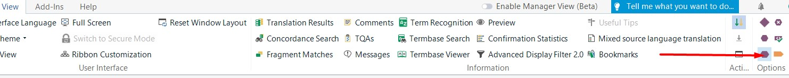
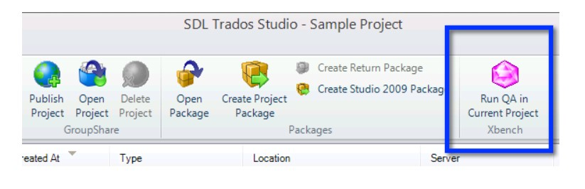
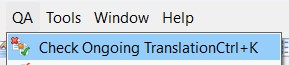

---

title: Self-revision + QA with Xbench
layout: default
nav_order: 5

---

SELF-REVISION
===============

Translating the entire project is not the end of your task. As a part of our quality standard policy, you must conduct two additional steps:

1. Self-revision of your work
2. QA with Xbench 

**SELF-REVISION OF YOUR WORK**

It means carefully reading the entire text, paying special attention to the following aspects:

**Spelling**

This is the most important part of the self-revision task that you can do automatically. Press the F7 button and carefully verify all the potental errors.

>Caution ⚠️
Please remember that not all the "mistakes" shown by Trados spellcheck are wrong. Even though this function relies on some modern solutions, including Hunspell, it is not perfect enough to be fully trusted. Always use your knowledge of the Polish language!

This part of the task can be also performed with Xbench. Please see the instructions below for further clarifications.

**Consistency**

Don't forget that one source term should have in most cases only **ONE** equivalent in the target. This is especially important for the reader who needs to follow certain procedures promptly without confusion.

**Style**

As you know from previous chapters, you will work with several different files that have their own requirements for the style. Before starting your self-revision, please reach out to the [File types - what can you expect](File_types - what_can_you_expect.html) chapter. 

**Tags**

The last element you need to consider are purple text elements called tags. Handling tags in a correct way is important for the formatting and structure as in the original document:

1) Please make sure you have enabled the full tag view. To do so, please:

- Go to the "View" tab on the ribbon menu at the top of the Trados Studio window.

- Within the "View" tab, locate the "Options" group.

- Now select "Full Tag Text". This lets you see the whole tags.

2) Usually the tags in target should be the same as in source. Read the sentence in the source and check if the corresponding tags were put at the relevant places in the target.
When in doubt about the word/object represented by a tag, please consult the PDF reference provided and/or approach the client's project manager.

3) The easiest way to verify if the tags were placed correctly is to run the QA with xBench. This will be explained a bit further on.

QA WITH XBENCH
===============

Even the best, most careful translator can omit some basic mistakes that appear in their own text. Consequently, you must conduct an additional, automatic quality assurance process with a third-party tool called Xbench. 
To start using it, press the purple gem icon in Trados. 

*Credits for the image: https://docs.xbench.net/plugin-studio/using-the-plugin/*

Even though this tool offers a wide range of options, you just need to know the most basic ones - please read before starting QA with Xbench:

| Category                                 | Description                                                                                           |
|------------------------------------------|-------------------------------------------------------------------------------------------------------|
| Untranslated Segments                    | Segments that have not been translated.                                                               |
| Same Source Text, Different Target Text  | Segments that may be translated inconsitently.                                                        |
| Same Target Text, Different Source Text  | Segments that may be unified by mistake.                                                              |
| Identical Source and Target Text         | Segments where target is identical to source - potentially untranslated text.                         |
| Tag Mismatches                           | Segments with inconsistencies or mismatches in tag usage between source and target.                   |
| Number Mismatches                        | Segments with inconsistencies in numeric values between source and target.                            |
| URL Mismatches                           | Segments with inconsistencies or mismatches in URLs between source and target.                        |
| Alphanumeric Mismatches                  | Segments with inconsistencies or mismatches in alphanumeric characters between source and target.     |
| Unpaired Symbols                         | Segments with unpaired symbols such as parentheses, square brackets, or braces.                       |
| Unpaired Quotes                          | Segments with unpaired quotation marks.                                                               |
| Repeated Words                           | Segments containing repeated words.                                                                   |
| Double Blanks                            | Segments containing consecutive spaces.                                                               |
| CamelCase Words                          | Segments containing words in CamelCase format without a counterpart in source.                        |
| Uppercase Words                          | Segments containing words fully in uppercase without a counterpart in source.                         |
| Spell-checking Issues                    | Segments with spelling errors identified during spell-checking.                                       |

>Before you start your QA, please make sure that you have checked the "Exclude locked segments" option. It is irrelevant to our project, as we are not able to unclock the files manually.

Not that you know the categories and their meanings, you are ready to start your QA process: press the "QA" button in the upper toolbar and then proceed to "Check Ongoing Translation". 

As a result you will get a report with the error categories prepared on the basis of your output. Each of them contains the segments in which those issues occurred, together with their number. 
<!-- Image of a sample Xbench report??? -->

Here's what to do to maximize the chance of spotting (and correcting) all errors:

1) **Review Issues:** Go through the issues identified in the report one by one. Even though the segment may seem OK at first glance, double-check it.

2) **Fix Issues in Translation Tool:** If you find any real issues in the translation, you should go back to Trados and make the necessary corrections. Remember to confirm the segments again after editing them!

3) **Re-run QA Check (Optional):** After your corrections are done, you can re-run the QA check in Xbench to ensure that the issues have been addressed.

4) **Save or Export Report:** Once you're satisfied with the corrections, please save or export the Xbench report. Our client might ask for it. To do so, click "Project" and then "Save as".
