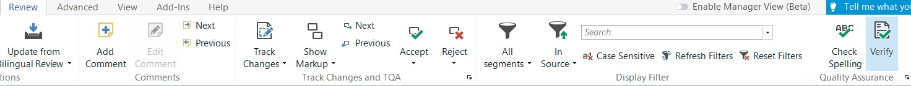
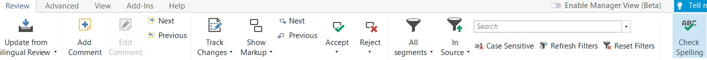
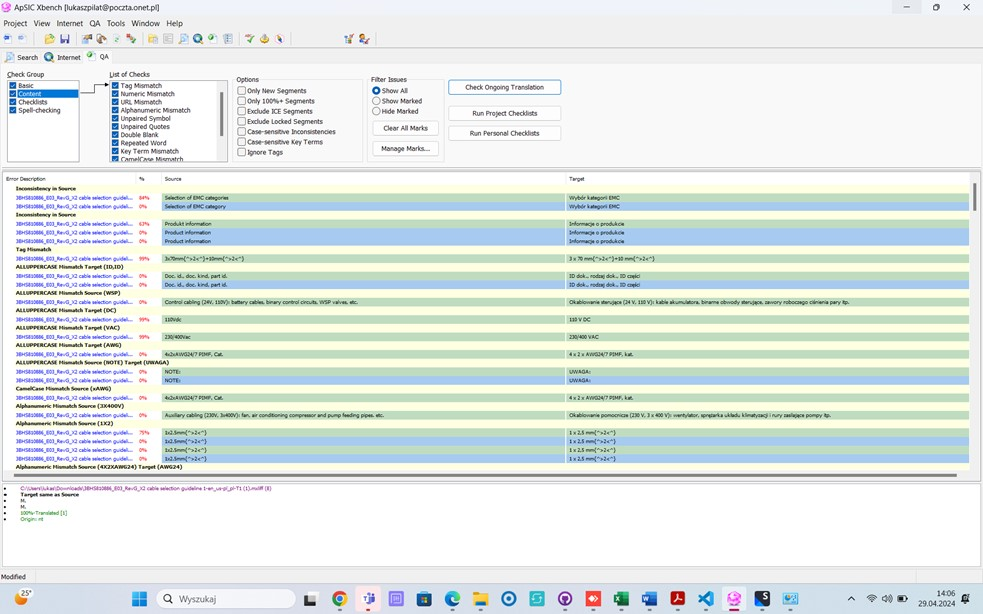

---

title: Useful hints while translating
layout: default
nav_order: 7

---

USEFUL HINTS WHILE TRANSLATING
===============

Now that you have studied most of the topics, you may still have doubts. Here you can find answers to some of the frequently asked questions, but it is not meant to be a one and only solution.

If you need more help, ask your project manager.

**Question**: I have Internet problems, which means I cannnot connect to Xbench in order to perform QA. What should I do?

**Answer**: No Internet connection does not prevent you from performing a QA. Trados has an in-built QA module with almost the same functionality as Xbench.

Open the file, go to the "Review" tab and press the "Verify" buttton. You will see a pop-up window with a list of detected errors. You can see a short description of an issue and, by clicking it, you will go to a certain row with a potential error. 

The same rule applies to **spellcheck**. In order to check if your translation is free of typos, open the file, go to the "Review" tab and click "Check Spelling". The pop-up window will show, presenting any suspicious instances and giving you some hints for corrections. In case of repetitive erros, you can correct them globally by hitting "Change all" button.

**Question**: The final Xbench report lists many errors even though the translation was done very carefully, with all the reference materials in mind. How is this possible and should I worry?

**Answer**: Even though Xbench is a smart and very helpful tool, it is not perfect. It can flag segments as errors even though they are fully correct. To make thigs easier, have a quick look at the possible error sources:

| Title                     | Description                                                                                                                                                                                                                                 |
|---------------------------|---------------------------------------------------------------------------------------------------------------------------------------------------------------------------------------------------------------------------------------------|
| Numbers and Variables     | XBench may flag segments containing numbers or variables as potential errors if they deviate slightly from the source text. In some cases the Polish language requires the full form of numerals (e.g. "pięć" instead of "5"). In this case Xbench will alert you about this discrepancy. |
| Abbreviations and Acronyms| Technical texts, especially NARS, contain many industry-specific abbreviations. Since they are meant to replace a word/some words in the target language, they will be different. Since Xbench checks for consistency, it will automatically mark them as errors.                             |
| Segmentation Issues       | XBench might generate the so called “false posiitives” due to segmentation issues: one source segment may be translated to multiple target segments or vice versa. This is the case when sentence boundaries are not precisely defined or when translators use different segmentation preferences for clarity reasons.               |

In a nutshell, there is no instant solution for any "false positives" that are in fact fully OK. You need to carefully (and critically) review all the segments and use your common sense, automatically sorting out the segments that are perfectly correct in the target language at first glance.

**Please cast a look at this example:**

It goes without saying that some errors that you can see here are NOT the real ones.

For instance, the word NOTE is in uppercase as many technical acronyms, so XBench assumes it is one of them - however, it is a common noun.

**Question**: May I use machine translation? This would speed up the translation process and help me finish the task even before deadline.

**Answer**: Unfortunately no. According to the non-disclosure agreement that our company signed, we are not allowed to use any third-party translation providers, including machine translation services. Most of the files have sensitive data and proprietary information that would be saved in the machine translation system. Moreover, even the most advanced machine translation providers **don't mind the context of the entire file** or the segments translated earlier.

